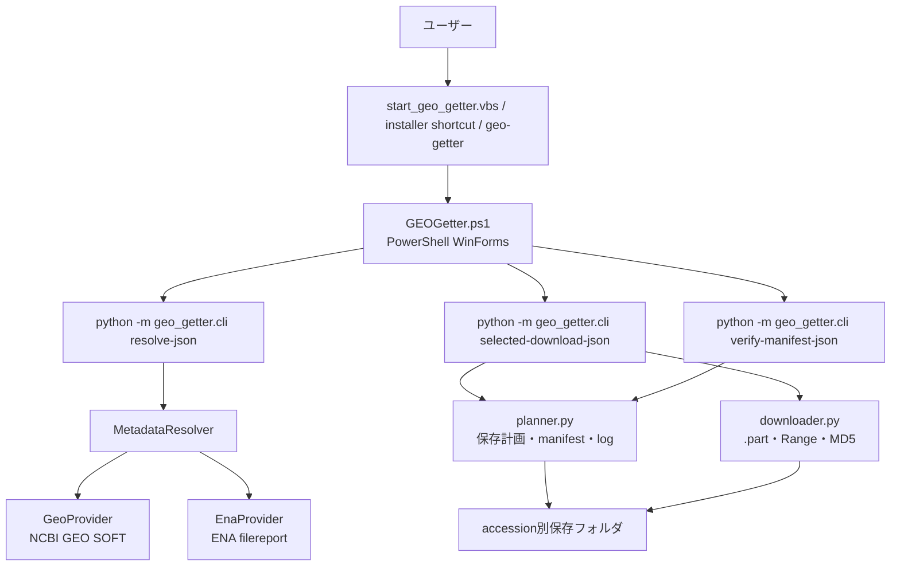

# アーキテクチャ

## 位置づけ

GEOGetter は、GEO レコード、GEO URL、SRA / ENA / Project / BioSample 系 accession を起点に、raw FASTQ と GEO supplementary / processed file を取得する Windows 向けデスクトップアプリである。

ユーザーは GUI から操作する。Python CLI は、GUI と Python コアをつなぐ中継役として使う。

実行環境:

- Windows x64 のデスクトップ利用を主対象にする。
- Python package entry point は GUI 起動用に使う。
- GUI は Python 関数を直接 import せず、subprocess と JSON で連携する。

## 全体像



主要な責務:

| 層 | 担当 | 責務 |
| --- | --- | --- |
| Launcher | `start_geo_getter.vbs`, `start_geo_getter.bat`, `geo_getter/app.py` | PowerShell WinForms GUI を STA で起動する |
| GUI | `GEOGetter.ps1` | 入力、表示、選択、保存先、非同期実行、進捗、キャンセル |
| CLI bridge | `geo_getter/cli.py` | GUI 用 JSON 入出力、index 選択、保存処理、manifest 再確認の起点 |
| Metadata core | `accession.py`, `providers/*` | accession 抽出、GEO/ENA 問い合わせ、候補統合 |
| Download core | `planner.py`, `downloader.py` | 出力先決定、manifest/log、容量確認、ダウンロード、MD5 検証 |

## 実行フロー

### 1. 起動

配布版では `runtime/python/python.exe` が存在すれば同梱 Python を使う。存在しない場合はローカル環境の `python` にフォールバックする。

`pyproject.toml` の console script は次を指す。

```toml
geo-getter = "geo_getter.app:main"
```

この entry point は `GEOGetter.ps1` を `powershell -NoProfile -STA -ExecutionPolicy Bypass -File` で起動するためのもの。

### 2. metadata 解決

GUI の検索処理は、一時ファイルに入力文字列を書き、次の内部 CLI を実行する。

```powershell
python -m geo_getter.cli resolve-json --input-file <temp-input> --out-json <temp-json>
```

`resolve-json` は、入力から最初に見つかった対応 accession を primary accession として使う。複数の accession が入力に含まれていても、先頭の 1 件だけを主入力にする。

入力種別ごとの処理:

| 入力 | 処理 |
| --- | --- |
| `GSE`, `GSM` | GEO SOFT を取得し、関連 SRA / ENA / Project / BioSample accession と supplementary file を探す |
| `SRP`, `SRX`, `SRR`, `SRS`, `ERP`, `ERX`, `ERR`, `ERS`, `DRP`, `DRX`, `DRR`, `DRS` | その accession を ENA filereport に直接問い合わせる |
| `PRJNA`, `PRJEB`, `PRJDB`, `SAMN`, `SAMEA`, `SAMD` | その accession を ENA filereport に直接問い合わせる |

GEO record から関連 accession が取れない場合、または ENA direct FASTQ が見つからない場合は、`warnings` に入れる。supplementary file がある場合は FASTQ がなくても表示対象になる。

### 3. GUI 表示と選択

GUI は `resolve-json` の JSON を `$script:Resolved` に保持し、次を表示する。

- GEO 情報: `Accession`, `Organism`, `Status`
- raw FASTQ 表
- GEO supplementary / processed file 表
- FASTQ 件数、supplementary 件数、選択容量、保存先空き容量

FASTQ 表と supplementary 表では、ソート後も元の配列と対応できるように、各行の `Tag` に zero-based index を入れる。ダウンロード時は、選択された `Tag` をカンマ区切りで CLI に渡す。

```powershell
--fastq-indices "0,2,5"
--supp-indices "1,4"
```

Python 側では、これを `resolve-json` の `fastq_files` / `supplementary_files` 配列 index として扱う。

### 4. ダウンロード

GUI のダウンロード処理は次の内部 CLI を非同期 subprocess として起動する。

```powershell
python -m geo_getter.cli selected-download-json `
  --input-json <resolved-json> `
  --fastq-indices <selected-fastq-indices> `
  --supp-indices <selected-supp-indices> `
  --out <output-parent>
```

`--out` は実保存フォルダではなく、ユーザーが選んだ親フォルダである。CLI はその下に `primary_accession` 名の実保存フォルダを作る。

```text
Downloads/GEOGetter/
  GSE52778/
    GSE52778_fastq_manifest.tsv
    GSE52778_supplementary_manifest.tsv
    GSE52778_download_log.tsv
    SRR1039508_1.fastq.gz
```

同名フォルダが存在し空でない場合は、既存成果物を上書きせず `GSE52778_2`, `GSE52778_3` のような suffix 付きフォルダを使う。

### 5. 保存済みFASTQ manifest再確認

GUI の `ツール > 保存済みFASTQを確認` は、保存済みの `*_fastq_manifest.tsv` を選び、次の内部 CLI を非同期 subprocess として起動する。

```powershell
python -m geo_getter.cli verify-manifest-json --manifest <fastq-manifest>
```

このコマンドは GUI から呼ぶ内部 JSON bridge であり、ユーザー向けの公開 CLI として扱わない。出力先は manifest と同じフォルダの `verification_report.tsv` である。

再確認では、manifest の `local_path` を優先してファイルを探す。フォルダ移動などで絶対パスが古く、同じフォルダに `file_name` のファイルが存在する場合は、manifest と同じフォルダのファイルを確認対象にする。

`verification_report.tsv` の主な status:

| status | 意味 |
| --- | --- |
| `md5_verified` | ファイルが存在し、サイズと MD5 が一致した |
| `md5_unavailable` | ファイルは存在するが、manifest に期待 MD5 がないため MD5 照合できない |
| `missing` | 確認対象ファイルが存在しない |
| `size_mismatch` | ファイルサイズが manifest の値と一致しない |
| `md5_mismatch` | サイズは一致するが MD5 が一致しない |

終了コード `0` は、すべての FASTQ が `md5_verified` の場合だけ返る。それ以外の status がある場合は、レポートを作成したうえで終了コード `1` になる。

### 6. 進捗と終了

`selected-download-json` は stdout に JSON Lines を出す。GUI は stdout を 1 行ずつ読み取り、進捗バー、ログ、完了表示を更新する。

`progress`:

```json
{
  "event": "progress",
  "kind": "fastq",
  "file_name": "SRR000001_1.fastq.gz",
  "downloaded": 1048576,
  "total": 5242880
}
```

`message`:

```json
{
  "event": "message",
  "message": "download_started: SRR000001_1.fastq.gz"
}
```

`done`:

```json
{
  "event": "done",
  "statuses": ["md5_verified", "download_complete"],
  "output_dir": "C:\\path\\GSE52778",
  "fastq_manifest": "C:\\path\\GSE52778\\GSE52778_fastq_manifest.tsv",
  "supplementary_manifest": "C:\\path\\GSE52778\\GSE52778_supplementary_manifest.tsv",
  "download_log": "C:\\path\\GSE52778\\GSE52778_download_log.tsv"
}
```

終了コード `0` は、選択ファイルの status がすべて `md5_verified` または `download_complete` の場合だけ返る。`md5_unavailable` はファイル保存済みでも MD5 未検証なので、終了コード `1` になる。

キャンセル時は、GUI が実行中の Python subprocess を停止する。`.part` は残る。ただし、次回の GUI 実行では新しい accession suffix フォルダが選ばれることがあるため、同じ `.part` が自動で再利用されるとは限らない。同じ実保存フォルダと同じ local path を使う場合だけ、downloader 側で `.part` を再利用できる。

## 診断情報

GUI は `診断情報を保存` / `Save diagnostics` から、問題報告用の zip をローカルに作成できる。自動送信はしない。

診断 zip の標準ファイル:

| ファイル | 内容 |
| --- | --- |
| `diagnostics.json` | version、実行日時、Python path、入力、選択 index、保存先、空き容量、最後の download done event |
| `resolved.json` | 最後に成功した `resolve-json` の結果 |
| `resolve_stdout.txt`, `resolve_stderr.txt` | metadata 解決 subprocess の標準出力と標準エラー |
| `download_stdout.jsonl`, `download_stderr.txt` | download subprocess の JSON Lines と標準エラー |
| `verify_stdout.jsonl`, `verify_stderr.txt` | manifest 再確認 subprocess の JSON Lines と標準エラー |
| `gui_log.txt` | GUI 下部ログの内容 |
| `artifacts/*` | 最後の download done event が返した manifest、download log、最後の manifest 再確認レポート |

診断 zip にはローカルパス、入力 accession、保存先、ファイル名が含まれる可能性があるため、ユーザーが必要時に手動で共有する。

## 外部データソース

### NCBI GEO SOFT

GEO metadata は次の endpoint から SOFT text として取得する。

```text
https://www.ncbi.nlm.nih.gov/geo/query/acc.cgi
```

主な query:

| query | 用途 |
| --- | --- |
| `acc=<accession>` | GEO accession |
| `targ=self` | record 本体 |
| `form=text` | SOFT text |
| `view=full` | 詳細 metadata |

`GSE` では sample 側の補完のため、`targ=gsm`, `view=brief` も取得する。取得に失敗した場合は本体 record の結果を使う。

主に読む SOFT key:

| key | 用途 |
| --- | --- |
| `Series_title`, `Series_status`, `Series_type`, `Series_summary`, `Series_overall_design` | dataset metadata |
| `Sample_title`, `Sample_status`, `Sample_organism_ch*`, `Sample_description` | sample metadata / dataset metadata 補完 |
| `Series_relation`, `Sample_relation` | ENA / SRA / Project / BioSample accession 探索 |
| `Series_supplementary_file`, `Sample_supplementary_file` | supplementary / processed file 探索 |

SOFT の relation や supplementary file が欠けている場合は、取得できた値だけを候補、warning、空欄として返す。

### ENA Portal API

raw FASTQ は ENA Portal API の `filereport` から得る。

```text
https://www.ebi.ac.uk/ena/portal/api/filereport
```

主な query:

| query | 値 |
| --- | --- |
| `accession` | GEO から得た関連 accession、または入力 accession |
| `result` | `read_run` |
| `format` | `json` |
| `download` | `false` |
| `limit` | `0` |

FASTQ 候補生成に使う field:

| field | 用途 |
| --- | --- |
| `fastq_ftp` | ダウンロード URL |
| `fastq_md5` | FASTQ の期待 MD5 |
| `fastq_bytes` | FASTQ の期待サイズ |
| `run_accession`, `experiment_accession`, `sample_accession`, `study_accession` など | 表示、manifest、GEO sample metadata との対応付け |

`submitted_ftp`, `submitted_md5`, `submitted_bytes` は取得 field に含めているが、保存対象の FASTQ 候補には使わない。

`fastq_ftp`, `fastq_md5`, `fastq_bytes` はセミコロン区切りで複数値を返すことがある。`parse_file_report()` は同じ run の read1/read2 を別々の `FastqFile` として展開する。

`ftp.sra.ebi.ac.uk/...` と `ftp://ftp.sra.ebi.ac.uk/...` は `https://ftp.sra.ebi.ac.uk/...` に正規化する。それ以外の URL 形式は、明示的な変換対象でない限りそのまま使う。

## データ形式

### `resolve-json`

`resolve-json` の top-level JSON:

```json
{
  "app_version": "0.1.2",
  "input_text": "GSE30567",
  "primary_accession": "GSE30567",
  "query_accessions": ["SRP007461"],
  "warnings": [],
  "dataset_metadata": {},
  "fastq_files": [],
  "supplementary_files": []
}
```

`dataset_metadata`:

| key | 内容 |
| --- | --- |
| `accession` | primary accession |
| `status` | GEO status。なければ空文字 |
| `title` | dataset title。なければ空文字 |
| `organism` | sample organism の重複なし結合。なければ空文字 |
| `experiment_type` | Series type の重複なし結合。なければ空文字 |
| `summary` | Series summary または sample description |
| `overall_design` | Series overall design |

`fastq_files` の主要 key:

| key | 内容 |
| --- | --- |
| `source_accession` | 元の GEO / 入力 accession |
| `query_accession` | ENA に問い合わせた accession |
| `run_accession` | ENA run accession |
| `file_index` | 同一 run 内の FASTQ index |
| `file_name` | URL から得たファイル名 |
| `url` | ダウンロード URL |
| `expected_md5` | ENA `fastq_md5`。なければ空文字 |
| `size_bytes` | ENA `fastq_bytes`。なければ `0` |
| `geo_sample_accession`, `geo_sample_title` | GEO sample と対応付けできた場合だけ入る |

`supplementary_files`:

| key | 内容 |
| --- | --- |
| `source_accession` | 元の GEO accession |
| `scope` | Series / Sample 由来の区分 |
| `name` | URL から得た保存候補名 |
| `url` | GEO supplementary / processed file URL |

### 出力ファイル

実保存フォルダの管理ファイル名はフォルダ名を prefix にする。`GSE52778_2` なら `GSE52778_2_download_log.tsv` になる。

同じ保存名の FASTQ が複数選ばれた場合は、`same.fastq.gz`, `same.2.fastq.gz` のように保存名をずらす。supplementary file も同名が複数あれば suffix を付けて衝突を避ける。

| ファイル | 作成条件 | 内容 | 文字コード |
| --- | --- | --- | --- |
| `<folder>_fastq_manifest.tsv` | FASTQ 選択時 | FASTQ 保存予定 | UTF-8 BOM |
| `<folder>_supplementary_manifest.tsv` | supplementary 選択時 | supplementary 保存予定 | UTF-8 BOM |
| `<folder>_download_log.tsv` | 常時 | ファイル単位の実行結果 | 初期化は UTF-8 BOM、追記は UTF-8 |

FASTQ manifest:

| 列 | 内容 |
| --- | --- |
| `source_accession` | 元の GEO / 入力 accession |
| `query_accession` | ENA query accession |
| `run_accession` | run accession |
| `file_index` | run 内 FASTQ index |
| `file_name` | 元の FASTQ ファイル名 |
| `url` | ダウンロード URL |
| `expected_md5` | 期待 MD5 |
| `size_bytes` | 期待サイズ |
| `local_path` | 保存予定パス |
| `status` | 初期値 `planned` |

download log:

| 列 | 内容 |
| --- | --- |
| `timestamp` | UTC ISO timestamp |
| `run_accession` | FASTQ run accession。supplementary は `GEO_SUPPLEMENTARY` |
| `file_name` | ファイル名 |
| `status` | `md5_verified`, `md5_unavailable`, `md5_mismatch`, `size_mismatch`, `network_failed`, `download_complete` など |
| `expected_md5` | FASTQ の期待 MD5。supplementary は空 |
| `actual_md5` | 実計算した MD5。supplementary は空 |
| `bytes_expected` | FASTQ の期待サイズ。supplementary は `0` |
| `bytes_downloaded` | 保存済み bytes |
| `message` | 人間向けメッセージ |

supplementary manifest:

| 列 | 内容 |
| --- | --- |
| `source_accession` | 元の GEO accession |
| `scope` | Series / Sample 由来の区分 |
| `file_name` | 保存候補名 |
| `url` | ダウンロード URL |
| `local_path` | 保存予定パス |
| `status` | 初期値 `planned` |

## 保存と完全性

FASTQ と supplementary file は完全性の扱いが違う。

| 種別 | 取得元 | 完全性の扱い | 成功 status |
| --- | --- | --- | --- |
| raw FASTQ | ENA `fastq_ftp` | ENA `fastq_md5` がある場合だけ照合する | `md5_verified` |
| raw FASTQ without MD5 | ENA `fastq_ftp` | 保存するが完全性は照合できない | `md5_unavailable` |
| supplementary / processed file | GEO SOFT URL | GEO SOFT から安定した期待 MD5 を得ないため照合しない | `download_complete` |

FASTQ 保存処理:

1. 保存先フォルダを作る。
2. 選択 FASTQ の合計 `size_bytes` と保存先空き容量を比較する。
3. FASTQ manifest と download log を準備する。
4. 完成済み同名ファイルがある場合、期待 MD5 が一致すれば再利用する。
5. 完成済み同名ファイルの MD5 が不一致、または期待 MD5 がない場合は quarantine 名に退避して取り直す。
6. 期待 MD5 がある完成済み `.part` は、サイズと MD5 が妥当なら正式ファイル名へ昇格する。
7. 途中 `.part` がある場合、HTTP `Range` で再開を試みる。期待 MD5 がない場合も、同じ local path の `.part` であれば Range 再開の対象になる。
8. 保存後、期待 MD5 があれば照合する。
9. MD5 一致なら `.part` を正式ファイル名へ置き換える。
10. 期待 MD5 がなければ正式ファイル名へ置き換え、`md5_unavailable` を記録する。
11. MD5 不一致またはサイズ過大なら正式名にせず quarantine 名へ退避する。
12. 結果を download log に追記する。

supplementary file は同じ `.part` ダウンロード関数を使うが、FASTQ manifest と MD5 照合は使わない。既存同名ファイルがあれば `.existing`, `.existing.2` のように退避する。

## エラーと状態

Python 側の status / error code は英語で統一する。GUI の主要ラベルと GUI 自身の説明文は `GEOGetter.ps1` の翻訳テーブルで日本語 / 英語を管理する。

主な status:

| status | 意味 |
| --- | --- |
| `md5_verified` | FASTQ の期待 MD5 と実 MD5 が一致した |
| `md5_unavailable` | FASTQ は保存したが ENA から期待 MD5 を得られなかった |
| `md5_mismatch` | FASTQ の MD5 が一致せず、正式ファイル名で保存しなかった |
| `size_mismatch` | 期待サイズと保存サイズが合わなかった |
| `network_failed` | 通信または OS error で保存できなかった |
| `download_complete` | supplementary / processed file を保存した |

ファイル単位の失敗は download log に残し、次のファイル処理へ進む。metadata 解決時に情報が不足した場合は `warnings` に記録し、該当する項目は空欄のまま返す。
