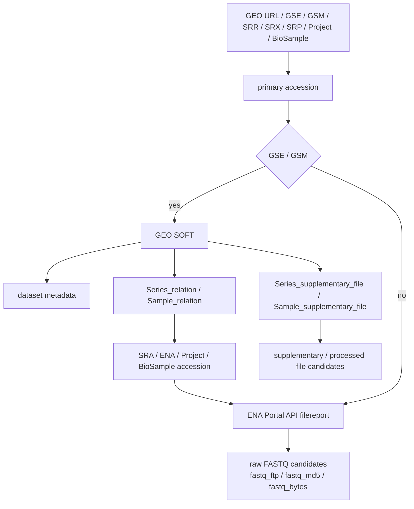
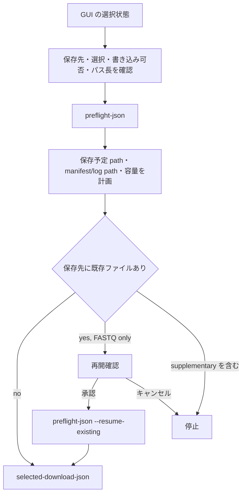
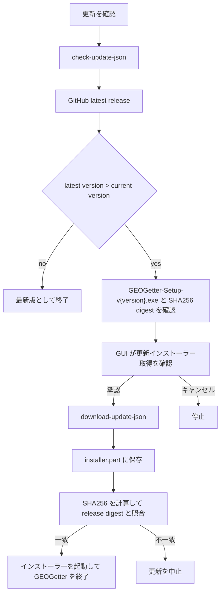

# データの流れ

GEOGetter は、入力された accession または GEO URL からファイル候補を作り、選択された raw FASTQ と GEO supplementary / processed file を保存する。

入力テキストに複数の accession や URL が含まれる場合は、最初に見つかった対応 accession を primary accession として扱う。

## 使うデータソース

| 名前 | 役割 |
| --- | --- |
| GEO | 研究、サンプル、supplementary / processed file の情報を持つ |
| GEO SOFT | GEO record をテキストで取得する形式 |
| SRA / ENA / Project / BioSample accession | raw sequencing data を ENA で探すための accession |
| ENA Portal API | raw FASTQ の URL、期待 MD5、ファイルサイズを返す |
| GitHub Releases API | アプリ更新確認で最新 release、installer asset、SHA256 digest を返す |

## 入力からファイル候補まで



入力が `GSE`、`GSM`、GEO URL の場合は、まず GEO SOFT を取得する。GEO SOFT から dataset metadata、関連 accession、supplementary / processed file の URL を読む。

GEO SOFT の `Series_relation` と `Sample_relation` に `SRP`、`SRX`、`SRR`、`SRS`、`PRJNA`、`SAMN` などがあれば、それを ENA Portal API `filereport` に問い合わせる。ENA から `fastq_ftp`、`fastq_md5`、`fastq_bytes` が返ると raw FASTQ 候補になる。

入力が `SRR`、`SRX`、`SRP`、`SRS`、`ERR`、`ERX`、`ERP`、`ERS`、`DRR`、`DRX`、`DRP`、`DRS`、`PRJNA`、`PRJEB`、`PRJDB`、`SAMN`、`SAMEA`、`SAMD` などの場合は、GEO SOFT を取得せず、入力 accession を ENA Portal API `filereport` に問い合わせる。

GEO から関連 accession を見つけた場合も、SRA / ENA / Project / BioSample accession を直接入力した場合も、raw FASTQ 候補を作る最終経路は ENA Portal API `filereport` で同じである。公開状態、データ種別、登録内容によっては FASTQ が見つからないことがある。

## supplementary / processed file

GEO supplementary / processed file は GEO SOFT の `Series_supplementary_file` と `Sample_supplementary_file` から見つける。

supplementary / processed file は GEO 側の URL から保存する。raw FASTQ のように ENA `fastq_md5` を使った MD5 照合は行わない。

## 保存前検査

`選択ファイルをダウンロード` を押すと、GUI は実際のダウンロードを始める前に保存前検査を行う。



GUI 側では、保存先が空でないこと、保存先が既存ファイルではないこと、フォルダを作成できること、一時ファイルを書き込めること、予定 path が長すぎないことを確認する。

Python 側の `preflight-json` は、選択 index を実ファイル候補に戻し、保存名の衝突を避けた最終 `local_path`、manifest path、download log path、`.part` path、必要容量、空き容量を返す。preflight は保存先フォルダを作成することがあるが、manifest、download log、選択ファイルは作成しない。

既存ファイルがある保存フォルダで supplementary / processed file を保存することはできない。既存ファイルがあり、選択が FASTQ だけの場合は、GUI が再開確認を出す。承認された場合だけ、既存 FASTQ manifest と download log が今回の FASTQ 選択と一致するかを確認してから続行する。

FASTQ の必要容量は ENA `fastq_bytes` の合計である。再開時は完成済み FASTQ と途中 `.part` を差し引いた残り容量を使う。supplementary / processed file は事前サイズを確定しないため、必要容量には入れない。

## 保存時に作成される情報

検索後、GUI の保存先欄には実際に保存する accession フォルダが表示される。選択したファイルは、保存先欄に表示されたフォルダ直下に保存する。

```text
Downloads/GEOGetter/
  GSE52778/
    GSE52778_fastq_manifest.tsv
    GSE52778_supplementary_manifest.tsv
    GSE52778_download_log.tsv
    SRR1039508_1.fastq.gz
```

raw FASTQ を選んだ場合は `*_fastq_manifest.tsv` が作成される。manifest には、元の GEO accession、ENA に問い合わせた accession、run accession、FASTQ URL、期待 MD5、期待サイズ、保存予定パスが入る。

GEO supplementary / processed file を選んだ場合は `*_supplementary_manifest.tsv` が作成される。manifest には、元の GEO accession、GEO SOFT 上の区分、URL、保存予定パスが入る。

`*_download_log.tsv` には、ファイルごとの保存結果が記録される。

保存済み FASTQ をあとから確認した場合は、manifest と同じフォルダに `verification_report.tsv` が作成される。

保存名は Windows のファイル名として安全な形に変換される。同じ保存名が複数ある場合は `same.fastq.gz`, `same.2.fastq.gz` のように suffix を付ける。大文字小文字だけが違う名前も Windows 上では同じ path になるため、衝突として扱う。manifest や download log と同じ名前になる候補も避ける。

## 完全性確認の違い

| 種別 | URL の取得元 | MD5 照合 | 主な成功 status |
| --- | --- | --- | --- |
| raw FASTQ | ENA `fastq_ftp` | ENA `fastq_md5` がある場合に行う | `md5_verified` |
| 期待 MD5 なし raw FASTQ | ENA `fastq_ftp` | 期待 MD5 がないため行えない | `md5_unavailable` |
| supplementary / processed file | GEO SOFT の supplementary URL | 行わない | `download_complete` |

`md5_unavailable` は、ファイルは保存されたが MD5 で完全性を確認できない状態を表す。この場合、照合対象となる期待 MD5 がないため、保存時の download log に実測 MD5 は記録しない。`download_complete` は、GEO supplementary / processed file を保存した状態を表す。

保存済み FASTQ の確認では、manifest に記録されたサイズと MD5 を使って確認する。期待 MD5 がない FASTQ は、ファイルが存在していても `md5_unavailable` になる。ファイルがない場合は `missing`、サイズが合わない場合は `size_mismatch`、MD5 が合わない場合は `md5_mismatch` になる。

## 途中ファイルと既存ファイル

ダウンロード中のファイルは `.part` として保存される。同じ保存パスに `.part` が残っている場合は、HTTP Range で再開を試みる。HTTP 206 と妥当な `Content-Range` が返れば追記し、そうでなければ最初から取り直す。

通信失敗、HTTP 429、HTTP 5xx は最大 4 回まで再試行する。`Retry-After` がある場合はその待機時間を使い、ない場合は 1 秒、3 秒、9 秒の順に待機する。再試行待機中は GUI の status が「通信再試行待機中」になる。再試行しても保存できなかった場合は `network_failed` として記録する。

FASTQ は 1 から 4 件まで同時に保存でき、既定値は 2 である。進捗はファイル単位の bytes と、選択 FASTQ 全体の aggregate bytes の両方で GUI に渡される。

既存ファイルがある保存フォルダで FASTQ を再開する場合は、既存の `*_fastq_manifest.tsv` と `*_download_log.tsv` が今回の FASTQ 選択と一致する場合だけ続行する。過去の `*_download_log.tsv` に GEO supplementary / processed file の記録があっても、今回の FASTQ 選択とは別に扱う。一致しない場合や必要な記録がない場合は、推測で続行せず停止する。

完成済みの同名 FASTQ は、期待サイズがある場合はサイズも確認したうえで、期待 MD5 が一致する場合だけ再利用する。MD5 が合わない場合、期待サイズがあるのにサイズが合わない場合、または期待 MD5 がない既存 FASTQ は、正式ファイル名のまま使わず別名に退避して取り直す。

GEO supplementary / processed file は MD5 照合を行わない。既存ファイルがある保存フォルダでは保存せず、空の保存先を選ぶ必要がある。

## アプリ更新確認

`ヘルプ > 更新を確認` / `Help > Check for updates` は、GitHub Releases API の latest release を確認する。



更新確認では、latest release tag と現在の package version を数値として比較する。新しい version がある場合は、latest release に `GEOGetter-Setup-v<version>.exe` があり、その asset に `sha256:<64 hex>` 形式の digest があることを要求する。

更新インストーラーの取得も通常の downloader を使うため、`.part`、サイズ確認、HTTP Range、HTTP 429 / 5xx 再試行、`Retry-After` に対応する。取得後に SHA256 が digest と一致した場合だけ正式な `.exe` として保存し、GUI がそのインストーラーを起動してアプリを終了する。

## FASTQ が見つからない場合

GEO record に raw sequencing data への relation がない場合、または ENA Portal API から direct FASTQ が返らない場合、raw FASTQ 表は空になる。

この場合でも、GEO supplementary / processed file が SOFT text に載っていれば、supplementary 表には表示される。


